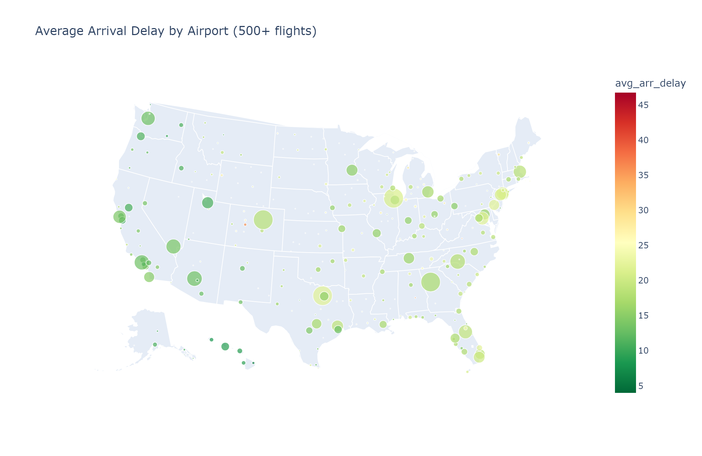
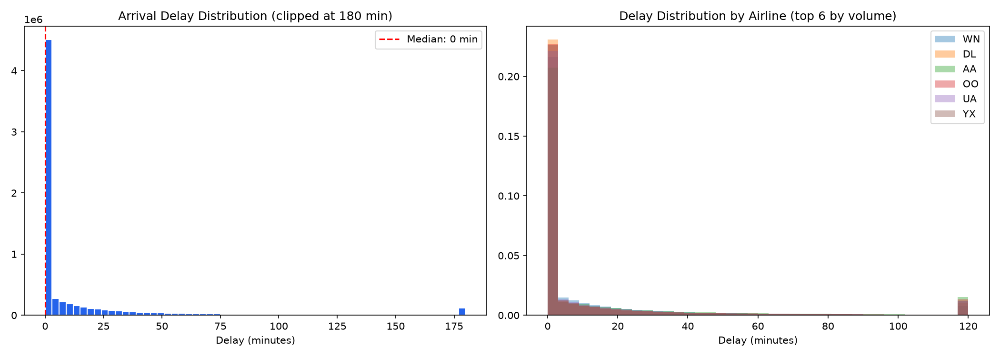
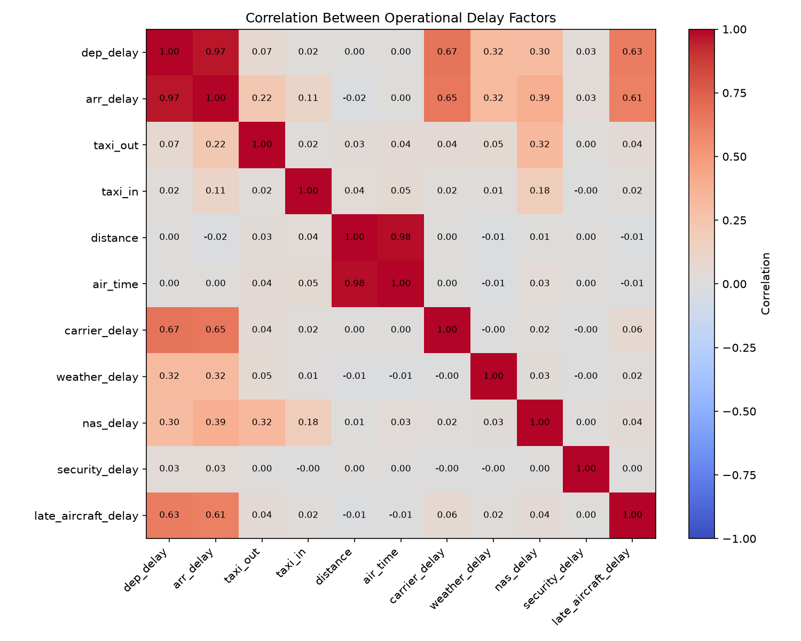
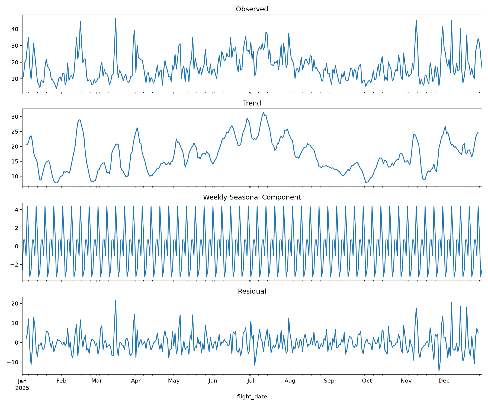
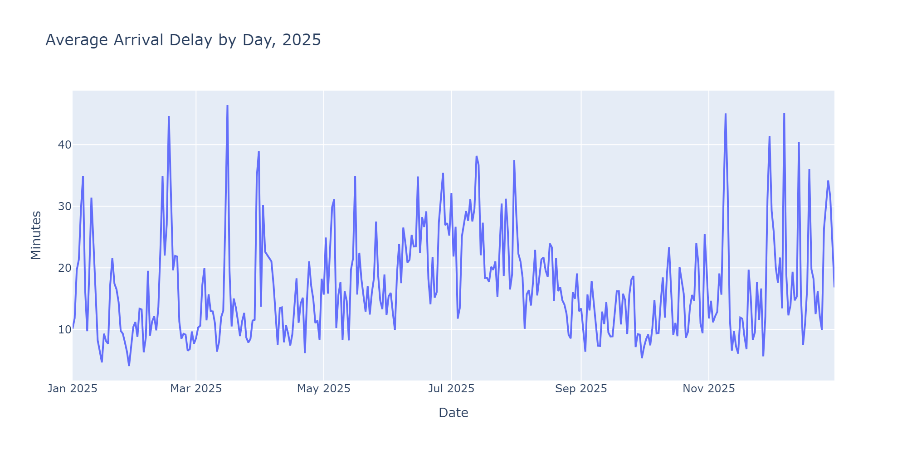

# Global Airline Performance Analytics

**What operational factors drive flight delays?** A full-pipeline analysis of 7 million US domestic flights, from raw government data through a database, statistical testing, and an interactive dashboard.



---

## TL;DR

| Finding | Evidence |
|---|---|
| Carrier-controlled issues, not weather, dominate delay | Carrier & late-aircraft delay correlate 0.6-0.67 with arrival delay vs. 0.32 (weather), ~0 (security) |
| Sunday specifically, not weekends generally, is the worst day | 21.4 min avg vs. ~18 min weekday avg; Saturday runs near the weekday level |
| Delay cascades across the flying day | 10 min average at midnight → 26 min by 7-8pm |
| July nearly doubles September's delay | 24.55 min vs. 12.05 min, the two seasonal extremes |
| Airline size doesn't predict reliability | Hawaiian Airlines, the smallest carrier by volume, ranks #1 on-time (81.9%) |
| One route stands far above the rest | CKB → Sanford (SFB): 93.98 min average delay across 113 flights, 5.4x the dataset average |

---

## The Data

- **Source**: US Bureau of Transportation Statistics, Reporting Carrier On-Time Performance dataset
- **Scope**: full calendar year 2025 — **7,001,619 flights**, 14 major US carriers, 352 airports
- **Supplementary**: OpenFlights airline and airport reference data (with real gaps found and corrected — see below)

## Tools

| Layer | Tools | What was actually used |
|---|---|---|
| Database | MySQL 8.0 | Complex multi-table joins, window functions, `RANK()`, CTEs (including recursive CTEs for date generation), views, a stored procedure for batched updates |
| Analysis | Python (pandas, numpy, dask, scipy, statsmodels) | dask for multi-file raw ingestion, scipy for chi-square/ANOVA, statsmodels for seasonal decomposition |
| Visualization | matplotlib, plotly, geopandas | Geographic mapping with real airport coordinates, not geocoded guesses |
| Dashboard | Power BI | 6-page interactive report — bookmarks, drill-through, dynamic titles, a geographic map, synced slicers, a field parameter. `.pbix` included in this repo; walkthrough showcased on LinkedIn |
| Reporting | Excel | Pivot-table KPI workbook for stakeholders without Power BI access |

---

## The Analysis

**Delays are heavily right-skewed** — most flights are on-time or early, but a long tail of severe delays pulls the average well above the median (mean 17.3 min, median 0.0 min, skew 10.93). This shapes every statistical choice made afterward, medians and effect sizes are reported alongside means throughout, not means alone.



**What actually causes delay, isolated by correlation:**



Carrier delay and late-aircraft delay (a cascading effect — an aircraft running behind on one leg stays behind on the next) correlate with arrival delay far more strongly than weather or security. `distance` and `air_time` correlating at 0.98 also serves as a data-validity check — that's exactly what should happen if the underlying data is internally consistent.

**A real, statistically decomposed seasonal pattern:**



Trend, weekly seasonality, and residual noise, isolated with `statsmodels`. The trend alone confirms delay peaks in summer (June-July, thunderstorms plus peak travel volume) and bottoms out in September, the calmest month of the year.

**The full daily picture:**



---

## Excel KPI Workbook

A pivot-table version of the same KPIs for stakeholders without Power BI access:


---

## Data Quality & Rigor

Real problems were found and fixed during this project, not assumed away:

- **Two airports (EAR, XWA)** missing from the OpenFlights community reference dataset, manually verified against current FAA data and added
- **Two airline codes mislabeled with defunct carrier names**: `OH` was tagged "Comair" (shut down 2012; the code now belongs to PSA Airlines), `YX` was tagged "Midwest Airlines" (code retired 2010; now Republic Airways) — both verified and corrected
- **A Windows CRLF line-ending mismatch** silently appended a stray character to every value in one loaded column, caught via systematic length-checking (`LENGTH()`) rather than assumed correct, and fixed with a batched stored procedure to handle the update at scale
- **An unweighted-average statistical error**, found first in an Excel pivot table (a naive average of daily percentages showed one airline's on-time rate 2.4 points too high) and then found *again*, retroactively, in an earlier Python calculation that had made the identical mistake. Both were corrected using flight-volume-weighted averages.

---

## Repository Structure

```
airline-performance/
├── data/              # raw and processed data (not tracked — see Reproducing This Project)
├── sql/               # schema DDL and analysis queries (joins, window functions, CTEs, views, stored procedures)
├── notebooks/         # data acquisition through statistical analysis
├── powerbi/           # Power BI dashboard (.pbix)
├── excel/             # KPI pivot-table workbook
├── images/            # chart exports used in this README
├── requirements.txt
└── README.md
```

## Reproducing This Project

Raw data isn't tracked in this repo (the full year of BTS files runs several hundred MB). To reproduce:

1. Create a MySQL 8.0 database and run `sql/schema.sql`
2. Run `notebooks/01_data_acquisition.ipynb` to pull and clean the BTS data
3. Run the second notebook for EDA and statistical analysis
4. Open `powerbi/*.pbix` and point the MySQL connection at your local instance

## What I'd Do With More Time

- Build the `aircraft` dimension table from the FAA aircraft registry, joined on tail number
- Bring in NOAA weather data to test whether BTS's self-reported weather-delay attribution understates true weather impact
- Extend to multiple years to formally decompose annual (not just weekly) seasonality
- Investigate whether the CKB → SFB and broader SFB-route pattern connects to a specific operating carrier
